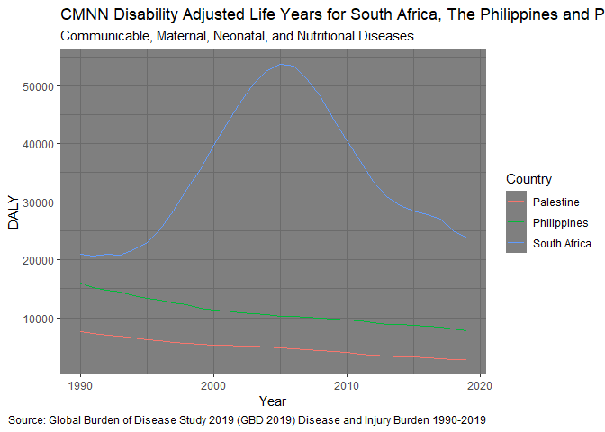
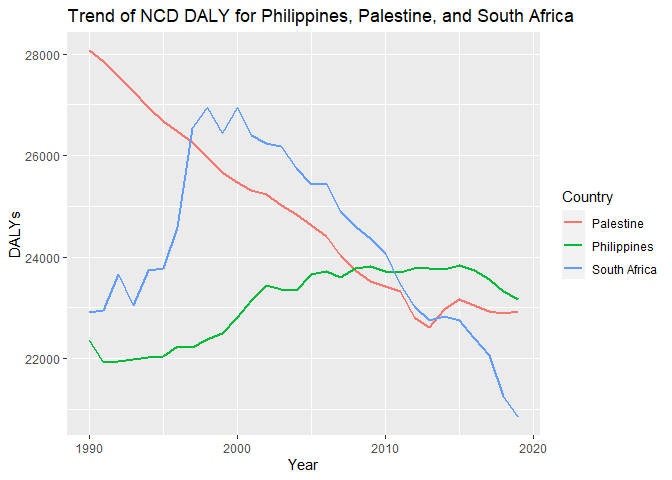
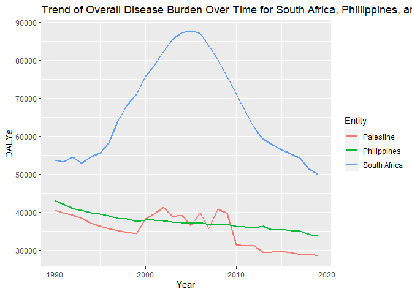

Global Disease Burden Analysis
================
Everlyn, Olga and Yaman

# Introduction

This document compares the Disability-Adjusted Life Year (DALY) diseases
burden for three countries: Palestine, Philippines, and South Africa. We
compare the burden due to communicable, maternal, neonatal, and
nutritional diseases (CMNN), non-communicable diseases (NCDs), and
overall disease burden for these countries.

The source data is from the Institute for Health Metrics and Evaluation
(IHME) Global Burden of Disease (GBD) study.

# Communicable, Maternal, Neonatal, and Nutritional Disease Burden (CMNN)

## Table of Estimates for CMNN Burden Over Time

| Year | Palestine | Philippines | South Africa |
|-----:|----------:|------------:|-------------:|
| 1990 |  7607.500 |   15958.382 |     21011.64 |
| 1991 |  7350.266 |   15195.089 |     20646.69 |
| 1992 |  7044.780 |   14783.262 |     20961.17 |
| 1993 |  6766.365 |   14380.337 |     20733.49 |
| 1994 |  6456.159 |   13876.810 |     21688.30 |
| 1995 |  6199.736 |   13408.199 |     22983.17 |
| 1996 |  5989.248 |   12988.338 |     25080.30 |
| 1997 |  5794.442 |   12522.044 |     28394.88 |
| 1998 |  5606.405 |   12199.464 |     32079.65 |
| 1999 |  5434.253 |   11588.719 |     35567.27 |
| 2000 |  5324.770 |   11324.390 |     39770.06 |
| 2001 |  5241.155 |   11127.493 |     43351.42 |
| 2002 |  5185.199 |   10912.936 |     47021.06 |
| 2003 |  5113.526 |   10666.509 |     50314.47 |
| 2004 |  4989.474 |   10553.556 |     52677.09 |
| 2005 |  4766.721 |   10328.272 |     53721.19 |
| 2006 |  4609.993 |   10299.519 |     53340.40 |
| 2007 |  4455.890 |   10105.199 |     51198.48 |
| 2008 |  4293.325 |    9907.263 |     48249.60 |
| 2009 |  4145.576 |    9823.857 |     44284.14 |
| 2010 |  3978.894 |    9694.186 |     40551.60 |
| 2011 |  3796.103 |    9482.070 |     36923.92 |
| 2012 |  3620.910 |    9152.378 |     33496.08 |
| 2013 |  3456.365 |    8921.654 |     30854.99 |
| 2014 |  3321.055 |    8784.079 |     29399.01 |
| 2015 |  3203.386 |    8767.712 |     28383.47 |
| 2016 |  3073.140 |    8561.664 |     27854.71 |
| 2017 |  2923.317 |    8450.030 |     26968.94 |
| 2018 |  2845.454 |    8080.506 |     24952.88 |
| 2019 |  2767.842 |    7841.392 |     23778.37 |

## Plot Showing Trends in CMNN Burden Over Time

<!-- -->

## Summary of CMNN Burden Findings

Based on the graph, South Africa uniquely exhibited an upward trend in
the cmnn DALY, peaking in 2005, before decreasing, yet still remaining
higher than both Palestine and the Philippines. The sharp rise in South
Africa’s DALY could largely be attributed to the HIV pandemic,
considering South Africa has one of the highest populations of
HIV-positive individuals. The subsequent decline post-2005 is likely
linked to the reduction in HIV prevalence, driven by enhanced HIV
prevention and treatment programs.

# Non-Communicable Disease Burden (NCD)

## Table of Estimates for NCD Burden Over Time

| Year | Palestine | Philippines | South Africa |
|-----:|----------:|------------:|-------------:|
| 1990 |  28065.46 |    22350.97 |     22903.42 |
| 1991 |  27850.96 |    21920.05 |     22954.29 |
| 1992 |  27551.80 |    21940.06 |     23656.98 |
| 1993 |  27268.61 |    21981.92 |     23047.14 |
| 1994 |  26948.47 |    22029.13 |     23733.88 |
| 1995 |  26674.49 |    22047.08 |     23777.26 |
| 1996 |  26478.93 |    22232.67 |     24580.75 |
| 1997 |  26253.35 |    22223.44 |     26541.82 |
| 1998 |  25966.02 |    22374.94 |     26941.39 |
| 1999 |  25665.72 |    22489.80 |     26441.48 |
| 2000 |  25470.21 |    22813.14 |     26954.15 |
| 2001 |  25323.10 |    23142.42 |     26393.08 |
| 2002 |  25243.10 |    23430.59 |     26243.70 |
| 2003 |  25011.00 |    23360.65 |     26175.20 |
| 2004 |  24833.41 |    23347.25 |     25739.70 |
| 2005 |  24613.96 |    23666.45 |     25428.15 |
| 2006 |  24412.99 |    23721.66 |     25454.41 |
| 2007 |  24025.71 |    23607.68 |     24901.25 |
| 2008 |  23731.82 |    23776.59 |     24610.46 |
| 2009 |  23519.07 |    23818.85 |     24361.90 |
| 2010 |  23423.61 |    23719.61 |     24065.55 |
| 2011 |  23316.39 |    23697.51 |     23461.90 |
| 2012 |  22806.85 |    23778.89 |     23024.66 |
| 2013 |  22605.70 |    23769.65 |     22748.43 |
| 2014 |  22960.56 |    23751.02 |     22819.93 |
| 2015 |  23167.11 |    23840.80 |     22755.45 |
| 2016 |  23050.31 |    23738.39 |     22391.78 |
| 2017 |  22926.72 |    23552.32 |     22060.71 |
| 2018 |  22878.79 |    23331.00 |     21254.27 |
| 2019 |  22924.00 |    23163.47 |     20844.50 |

## Plot Showing Trends in NCD Burden Over Time

<!-- -->

## Summary of NCD Burden Findings

Provide a brief analysis based on the data presented in the table and
chart. Highlight any significant findings or patterns. About 3
sentences.

Palestine and South Africa has a significant drop in DALYs through time,
but for the Philippines it has an increase over the years until 2015.
Since the data is not normalized for population, a deeper analysis must
be done. It is noticeable though how the pattern for the Philippines is
different, owing perhaps to lifestyle and diet in the country.

# Overall Disease Burden

## Table of Estimates for Overall Disease Burden Over Time

| Year | Palestine | Philippines | South Africa |
|-----:|----------:|------------:|-------------:|
| 1990 |  40593.13 |    43149.40 |     53698.07 |
| 1991 |  39930.30 |    42137.21 |     53230.09 |
| 1992 |  39315.49 |    40959.93 |     54544.20 |
| 1993 |  38374.68 |    40536.11 |     52947.56 |
| 1994 |  37153.92 |    39960.87 |     54591.37 |
| 1995 |  36329.14 |    39483.62 |     55667.82 |
| 1996 |  35772.91 |    39060.23 |     58201.69 |
| 1997 |  35245.70 |    38489.42 |     64023.20 |
| 1998 |  34753.80 |    38302.82 |     68245.40 |
| 1999 |  34368.55 |    37705.04 |     70974.39 |
| 2000 |  38195.82 |    37885.01 |     75846.52 |
| 2001 |  39631.60 |    37879.61 |     78606.11 |
| 2002 |  41404.15 |    37824.40 |     82184.82 |
| 2003 |  38906.30 |    37432.44 |     85486.87 |
| 2004 |  39213.03 |    37271.14 |     87229.12 |
| 2005 |  36444.62 |    37214.25 |     87672.04 |
| 2006 |  39932.00 |    37385.60 |     87056.96 |
| 2007 |  35722.09 |    36810.60 |     83870.19 |
| 2008 |  40788.14 |    36869.26 |     80246.97 |
| 2009 |  39774.48 |    36839.50 |     75602.56 |
| 2010 |  31448.94 |    36390.98 |     71162.99 |
| 2011 |  31252.59 |    36226.05 |     66425.90 |
| 2012 |  31177.75 |    35986.03 |     62330.51 |
| 2013 |  29368.69 |    36300.91 |     59189.74 |
| 2014 |  29619.58 |    35418.66 |     57746.71 |
| 2015 |  29714.31 |    35510.18 |     56542.10 |
| 2016 |  29369.20 |    35265.92 |     55397.54 |
| 2017 |  28991.50 |    35017.88 |     54187.25 |
| 2018 |  29031.76 |    34278.84 |     51493.90 |
| 2019 |  28659.67 |    33798.13 |     49954.28 |

## Plot Showing Trends in Overall Disease Burden Over Time

<!-- -->

## Summary of Overall Disease Burden Findings

South Africa (blue line) shows a significant and unique trend among the
three. It begins with a steady rise in DALYs from 1990, peaks sharply
around the year 2005, and then exhibits a notable decline. This peak
likely indicates a severe health-related event or epidemic during that
period, which was followed by a successful mitigation leading to the
subsequent decline. The Philippines (green line) displays a relatively
flat trend with minor undulations over time, suggesting a stable DALYs
burden without dramatic increases or decreases. This could indicate
consistent health outcomes and possibly effective health interventions
to prevent major public health challenges. Palestine (red line) showed a
general downward trend in DALYs over the observed timeframe, indicating
an overall decrease in the burden of disease or disability. Notably,
there is an exception between 2000 and 2010, where there was a temporary
increase. This could point to a rising health burden during that decade,
potentially from non-communicable diseases (NCDs), or it could be due to
other factors such as demographic shifts, evolving health reporting
standards, or changes in the accessibility and quality of healthcare
